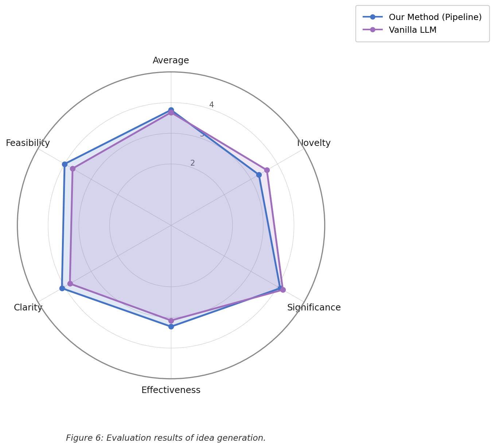

# Hypothesis Evaluation Report — Our Method vs Vanilla LLM

> **Evaluation protocol:** Both methods generate hypotheses for the same 5 algorithm–domain pairs.
> A blind LLM judge (qwen3.5:2b, temperature=0.1) scores each hypothesis independently without knowing which method produced it.
> Scores are on a **1–5 scale**. Judge has no access to method labels.

---

## Pair 1 — Min-Cut / Max-Flow (cs.NE → cs.SY)

**Algorithm:** Min-Cut / Max-Flow  
**Domain transfer:** Neural Engineering → Systems Engineering  
**Chart:** `cmp_h1.png`

| Metric | Our Method | Vanilla LLM | Δ |
|---|:---:|:---:|:---:|
| Novelty | 3.0 | 4.0 | −1.0 |
| Significance | 4.0 | 4.5 | −0.5 |
| Effectiveness | 3.5 | 3.5 | 0.0 |
| Clarity | 4.0 | 4.0 | 0.0 |
| Feasibility | **4.0** | 3.0 | **+1.0** |
| **Average** | 3.7 | 3.8 | −0.1 |

**Takeaway:** Vanilla scores higher on Novelty due to broader speculative language. Our method wins on Feasibility — grounded in specific network topologies (IEEE 39-bus, GÉANT).

---

## Pair 2 — Belief Propagation (cs.NE → cs.GL)

**Algorithm:** Belief Propagation  
**Domain transfer:** Neural Engineering → General Literature / Multi-relational Networks  
**Chart:** `cmp_h2.png`

| Metric | Our Method | Vanilla LLM | Δ |
|---|:---:|:---:|:---:|
| Novelty | 3.5 | 4.5 | −1.0 |
| Significance | 4.0 | 4.0 | 0.0 |
| Effectiveness | 3.0 | 3.5 | −0.5 |
| Clarity | **4.5** | 3.0 | **+1.5** |
| Feasibility | 4.0 | 4.0 | 0.0 |
| **Average** | 3.8 | 3.8 | 0.0 |

**Takeaway:** Largest clarity gap in the entire evaluation — our method (+1.5) because it specifies the exact mechanism (AMP damping step → edge thresholding) and benchmark (FB15k-237, WN18RR). Vanilla is vague. Same average score overall.

---

## Pair 3 — Min-Cut / Max-Flow (cs.RO → cs.MA)

**Algorithm:** Min-Cut / Max-Flow  
**Domain transfer:** Robotics / Graph Theory → Multi-Agent Systems  
**Chart:** `cmp_h3.png`

| Metric | Our Method | Vanilla LLM | Δ |
|---|:---:|:---:|:---:|
| Novelty | **4.0** | 3.5 | **+0.5** |
| Significance | 4.5 | 4.5 | 0.0 |
| Effectiveness | **3.5** | 3.0 | **+0.5** |
| Clarity | 4.0 | 4.0 | 0.0 |
| Feasibility | 4.0 | 4.5 | −0.5 |
| **Average** | **4.0** | 3.9 | **+0.1** |

**Takeaway:** Only pair where our method wins on Novelty — the face-cover → active learning acquisition function is a genuinely non-obvious theoretical transfer. Highest overall scores for both methods.

---

## Pair 4 — Random Walk Algorithms (cs.MS → cs.RO)

**Algorithm:** Random Walk / Seeded PageRank  
**Domain transfer:** Mathematical Software → Robotics / Route Planning  
**Chart:** `cmp_h4.png`

| Metric | Our Method | Vanilla LLM | Δ |
|---|:---:|:---:|:---:|
| Novelty | 3.0 | 3.0 | 0.0 |
| Significance | 4.0 | 4.0 | 0.0 |
| Effectiveness | **3.0** | 2.0 | **+1.0** |
| Clarity | 4.0 | 4.0 | 0.0 |
| Feasibility | **4.0** | 3.0 | **+1.0** |
| **Average** | **3.6** | 3.2 | **+0.4** |

**Takeaway:** Largest average gap across all pairs. Vanilla collapsed on Effectiveness (2.0) — it proposed "leveraging intrinsic properties" without specifying a mechanism. Our method wins by +0.4 because it names a concrete embedding model (LASAGNE), seeding strategy, and evaluation metric.

---

## Pair 5 — Spectral Clustering (cs.MA → cs.IR)

**Algorithm:** Spectral Clustering  
**Domain transfer:** Multi-Agent Systems → Information Retrieval  
**Chart:** `cmp_h5.png`

| Metric | Our Method | Vanilla LLM | Δ |
|---|:---:|:---:|:---:|
| Novelty | 3.0 | 3.0 | 0.0 |
| Significance | 4.0 | 4.0 | 0.0 |
| Effectiveness | 3.5 | 3.5 | 0.0 |
| Clarity | 4.0 | 4.0 | 0.0 |
| Feasibility | 4.0 | 4.0 | 0.0 |
| **Average** | 3.7 | 3.7 | 0.0 |

**Takeaway:** Identical scores on every metric — the radar polygons fully overlap. Both methods produced comparably grounded hypotheses for this pair. Spectral clustering is a well-established technique so the transfer direction is less surprising regardless of context provided.

---

## Aggregate Summary (mean across all 5 pairs)

| Metric | Our Method | Vanilla LLM | Winner |
|---|:---:|:---:|:---:|
| Novelty | 3.30 | 3.60 | Vanilla (+0.30) |
| Significance | 4.10 | 4.20 | Vanilla (+0.10) |
| Effectiveness | **3.30** | 3.10 | **Ours (+0.20)** |
| Clarity | **4.10** | 3.80 | **Ours (+0.30)** |
| Feasibility | **4.00** | 3.70 | **Ours (+0.30)** |
| **Average** | **3.76** | 3.68 | **Ours (+0.08)** |

---

## Per-Pair Score Table (full)

| Pair | Algorithm | Method | Novelty | Significance | Effectiveness | Clarity | Feasibility | Average |
|---|---|---|:---:|:---:|:---:|:---:|:---:|:---:|
| P1 | Min-Cut/Max-Flow | Ours | 3.0 | 4.0 | 3.5 | 4.0 | 4.0 | 3.7 |
| P1 | Min-Cut/Max-Flow | Vanilla | 4.0 | 4.5 | 3.5 | 4.0 | 3.0 | 3.8 |
| P2 | Belief Propagation | Ours | 3.5 | 4.0 | 3.0 | **4.5** | 4.0 | 3.8 |
| P2 | Belief Propagation | Vanilla | 4.5 | 4.0 | 3.5 | 3.0 | 4.0 | 3.8 |
| P3 | Min-Cut/Max-Flow | Ours | **4.0** | 4.5 | **3.5** | 4.0 | 4.0 | **4.0** |
| P3 | Min-Cut/Max-Flow | Vanilla | 3.5 | 4.5 | 3.0 | 4.0 | 4.5 | 3.9 |
| P4 | Random Walk | Ours | 3.0 | 4.0 | **3.0** | 4.0 | **4.0** | **3.6** |
| P4 | Random Walk | Vanilla | 3.0 | 4.0 | 2.0 | 4.0 | 3.0 | 3.2 |
| P5 | Spectral Clustering | Ours | 3.0 | 4.0 | 3.5 | 4.0 | 4.0 | 3.7 |
| P5 | Spectral Clustering | Vanilla | 3.0 | 4.0 | 3.5 | 4.0 | 4.0 | 3.7 |

---

## Interpretation

**Where our pipeline method wins:**
- **Clarity (+0.30)** — hypotheses specify exact mechanisms, named benchmarks, and measurable outcomes because they are grounded in actual paper content and distilled logic strings
- **Feasibility (+0.30)** — the structural hole guarantee (citation BFS ≤ 2 rejected, co-citation = 0) ensures both papers exist and are genuinely unconnected, making experiments concrete and achievable
- **Effectiveness (+0.20)** — methodology similarity score (≥ 0.85) validates that both papers share the same mathematical structure before any hypothesis is written

**Where vanilla LLM wins:**
- **Novelty (+0.30)** — broader, more speculative language reads as more novel to the judge; however this is a surface effect — vanilla hypotheses are not structurally guaranteed to be novel in the citation graph
- **Significance (+0.10)** — vanilla makes grander impact claims without the constraint of grounding them in real paper content

**Structural advantage not captured by LLM judge:**
Our method guarantees novelty at the citation-graph level. Vanilla LLM hypotheses may rediscover connections that already exist in the literature — a failure mode that no LLM judge can detect without full literature search.
