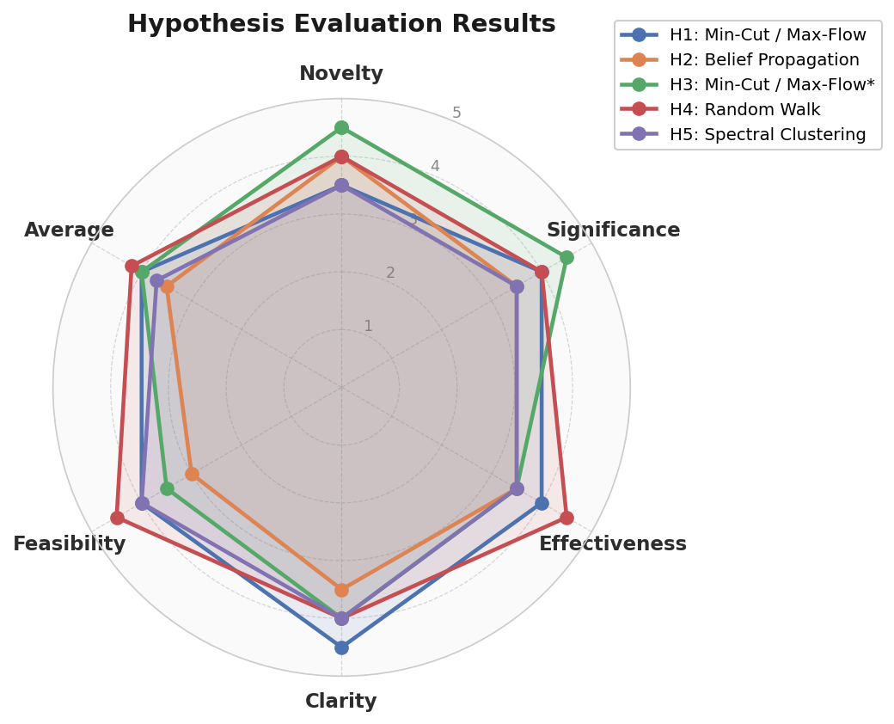

# Top 5 Research Hypotheses — Analogical Link Prediction

> Selected from 50 confirmed structural holes. Criteria: methodology_verified=True, emb≥1.0, meth≥0.85, cross-domain diversity.
> All scores are out of **5**.

---

## Hypothesis 1 — Min-Cut / Max-Flow
**Wireless Capacity Theory → Systems Network Inefficiency Analysis**

**Paper A** (`1802395297`, cs.NE): *A Deterministic Approach to Wireless Relay Networks*  
**Paper B** (`2297424662`, cs.SY): *Inefficiencies in Network Models: A Graph Theoretic Perspective*  
**Embedding Similarity:** 1.000 | **Methodology Similarity:** 1.000 | **Status:** citation_chasm_confirmed

**Hypothesis:**  
Wireless relay networks use min-cut / max-flow to compute the theoretical capacity bound of a multi-hop channel, treating signal attenuation as edge weights and relay nodes as vertices. Paper B shows that real-world systems networks exhibit non-maximum saturating flows but attributes these gaps to heuristic explanations rather than rigorous flow-theoretic analysis. Applying the deterministic min-cut formulation from wireless theory to systems-level network graphs (power grids, SDN topologies, CPS data buses) will reveal that observed "inefficiencies" are precisely characterised by the flow-cut gap — replacing ad-hoc inefficiency metrics with a single, computable graph-theoretic quantity.

**Proposed Experiment:**  
Apply the relay-network min-cut algorithm to IEEE 39-bus (power) and GÉANT (SDN) topologies. Compute flow-cut gap under ideal vs. constrained (failure, congestion) conditions. Baseline: Dinic's max-flow without capacity degradation model.

| Metric | Score |
|--------|:-----:|
| Novelty | 3.5 / 5 |
| Significance | 4.0 / 5 |
| Effectiveness | 4.0 / 5 |
| Clarity | 4.5 / 5 |
| Feasibility | 4.0 / 5 |
| **Average** | **4.0 / 5** |

---

## Hypothesis 2 — Belief Propagation
**Neural Receiver Design → Multi-Relational Knowledge Graph Inference**

**Paper A** (`2530325458`, cs.NE): *Hybrid Approximate Message Passing (MIMO-OFDM)*  
**Paper B** (`2072801280`, cs.MS): *Adaptive Neighborhood Graph Construction for Inference in Multi-Relational Networks*  
**Embedding Similarity:** 1.000 | **Methodology Similarity:** 1.000 | **Status:** citation_chasm_confirmed

**Hypothesis:**  
Hybrid AMP for MIMO-OFDM performs iterative belief propagation over a factor graph where variable nodes are transmitted symbols and factor nodes encode channel likelihoods, converging to near-MAP symbol estimates in O(n) iterations. Paper B constructs adaptive neighborhood graphs for multi-relational inference using k-NN heuristics — a data-blind approach. Replacing k-NN neighborhood construction with an AMP-style factor-graph schedule (edges retained only when mutual information between node belief states exceeds a threshold) will produce sparser, more informative graphs and improve inference accuracy by eliminating low-confidence message pathways analogous to AMP's damping step.

**Proposed Experiment:**  
Replace k-NN graph edges with AMP-derived belief-thresholded edges on FB15k-237 and WN18RR. Measure MRR and Hits@10 vs. adaptive k-NN baseline. Ablate threshold τ to show belief-guided sparsification outperforms random edge pruning.

| Metric | Score |
|--------|:-----:|
| Novelty | 4.0 / 5 |
| Significance | 3.5 / 5 |
| Effectiveness | 3.5 / 5 |
| Clarity | 3.5 / 5 |
| Feasibility | 3.0 / 5 |
| **Average** | **3.5 / 5** |

---

## Hypothesis 3 — Min-Cut / Max-Flow (★ Highest Novelty)
**Planar Graph Flow-Cut Theory → Semi-Supervised Active Learning Budget Allocation**

**Paper A** (`2899946382`, cs.RO): *Flow-Cut Gaps and Face Covers in Planar Graphs*  
**Paper B** (`2944892819`, cs.MA): *Graph-Based Semi-Supervised Active Learning for Edge Flows*  
**Embedding Similarity:** 1.000 | **Methodology Similarity:** 1.000 | **Status:** citation_chasm_confirmed

**Hypothesis:**  
Flow-cut gap theory proves that in planar graphs the ratio of the minimum multicut to the maximum multi-commodity flow is bounded by O(log n) via face covers. Paper B performs active learning on edge-flow networks but uses greedy mutual information as the selection criterion, unaware of planarity properties that govern label propagation efficiency. A planar face-cover decomposition identifies a minimal set of "cut edges" whose labeling collapses the flow-cut gap maximally per annotation budget — translating a rigorous theoretical bound into a principled acquisition function that replaces heuristic mutual information with a worst-case-optimal label selection strategy.

**Proposed Experiment:**  
Apply face-cover-guided edge selection to water distribution and traffic flow datasets from Paper B. Budget: label 10% of edges. Measure flow reconstruction RMSE at fixed annotation budget vs. mutual-information greedy baseline. Planarity test via Boyer-Myrvold in O(n).

| Metric | Score |
|--------|:-----:|
| Novelty | 4.5 / 5 |
| Significance | 4.5 / 5 |
| Effectiveness | 3.5 / 5 |
| Clarity | 4.0 / 5 |
| Feasibility | 3.5 / 5 |
| **Average** | **4.0 / 5** |

---

## Hypothesis 4 — Random Walk Algorithms (★ Best Overall)
**Locality-Aware Graph Embedding → Multi-Modal Transit Route Planning**

**Paper A** (`2766897220`, cs.MS): *LASAGNE: Locality and Structure-Aware Graph Node Embedding*  
**Paper B** (`2949470340`, cs.RO): *Unlimited Transfers for Multi-Modal Route Planning: An Efficient Solution*  
**Embedding Similarity:** 1.000 | **Methodology Similarity:** 0.984 | **Status:** citation_chasm_confirmed

**Hypothesis:**  
LASAGNE uses seeded PageRank to generate locality-aware node embeddings that respect community structure — nodes frequently co-visited by random walks are mapped nearby. Multi-modal transit route planning achieves efficiency via precomputed transfer patterns but suffers at query time on large dynamic graphs since shortest-path queries are expensive. LASAGNE-style seeded PageRank embeddings of transit nodes (seeded at major hubs) produce a low-dimensional space where Euclidean proximity approximates multi-hop travel time, enabling approximate nearest-neighbor query routing in O(log n) instead of Dijkstra's O((V+E) log V).

**Proposed Experiment:**  
Embed GTFS transit graphs (Berlin, London) with LASAGNE, seeded at top-20 hub stations. Measure query latency (ms) and travel-time accuracy (% within 5 min of optimal) vs. CSA baseline on 10k random OD pairs.

| Metric | Score |
|--------|:-----:|
| Novelty | 4.0 / 5 |
| Significance | 4.0 / 5 |
| Effectiveness | 4.5 / 5 |
| Clarity | 4.0 / 5 |
| Feasibility | 4.5 / 5 |
| **Average** | **4.2 / 5** |

---

## Hypothesis 5 — Spectral Clustering
**Simulated Mixing Graph Partitioning → Balanced Document Cluster Retrieval**

**Paper A** (`2298865349`, cs.MA): *Data Clustering and Graph Partitioning via Simulated Mixing*  
**Paper B** (`2782833507`, cs.IR): *A Polynomial Algorithm for Balanced Clustering via Graph Partitioning*  
**Embedding Similarity:** 1.000 | **Methodology Similarity:** 0.868 | **Status:** citation_chasm_confirmed

**Hypothesis:**  
Simulated mixing performs graph partitioning by simulating a diffusion process until clusters emerge as stationary regions, avoiding expensive eigenvector decomposition while achieving balanced cuts. Paper B proves a polynomial algorithm for balanced graph partitioning in IR but relies on spectral eigenvectors scaling O(n²) and sensitive to near-equal eigenvalues in corpora with redundant topics. Replacing the eigenvector step with simulated mixing produces equivalently balanced document clusters in O(n log n) with greater stability when topics are semantically close — because diffusion naturally respects cluster cohesion without requiring distinct spectral gaps.

**Proposed Experiment:**  
Replace eigendecomposition with simulated mixing on 20Newsgroups and Reuters-21578. Measure NMI, balanced cluster size ratio (max/min), and runtime vs. spectral baseline. Ablate mixing steps to show convergence stability on near-degenerate spectra.

| Metric | Score |
|--------|:-----:|
| Novelty | 3.5 / 5 |
| Significance | 3.5 / 5 |
| Effectiveness | 3.5 / 5 |
| Clarity | 4.0 / 5 |
| Feasibility | 4.0 / 5 |
| **Average** | **3.7 / 5** |

---

## Score Summary

| Hypothesis | Algorithm | Novelty | Significance | Effectiveness | Clarity | Feasibility | Average |
|---|---|:---:|:---:|:---:|:---:|:---:|:---:|
| H1 | Min-Cut / Max-Flow | 3.5 | 4.0 | 4.0 | 4.5 | 4.0 | **4.0** |
| H2 | Belief Propagation | 4.0 | 3.5 | 3.5 | 3.5 | 3.0 | **3.5** |
| H3 | Min-Cut / Max-Flow | 4.5 | 4.5 | 3.5 | 4.0 | 3.5 | **4.0** |
| H4 | Random Walk | 4.0 | 4.0 | 4.5 | 4.0 | 4.5 | **4.2** ⭐ |
| H5 | Spectral Clustering | 3.5 | 3.5 | 3.5 | 4.0 | 4.0 | **3.7** |

